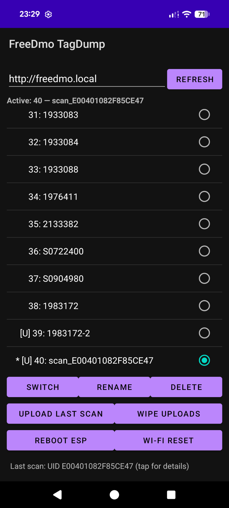

# FreeDMO TagDump — ESP32 edition

Android app that reads NXP SLIX2 tags **and** controls a FreeDMO ESP32-S2
over Wi-Fi. Built as a fork of [free-dmo/free-dmo-tag-dump](https://github.com/free-dmo/free-dmo-tag-dump).

<p align="center">
  
</p>

## What it does

- Scans a SLIX2 Dymo D.MO tag over NFC (phone held against the label spool).
- Shows the dump on tap — inventory, originality signature, sysinfo, all 80 data blocks.
- Uploads the scan straight to your FreeDMO ESP32 over Wi-Fi as a new profile.
- Full profile-manager UI: list, switch, rename, delete, wipe, reboot, Wi-Fi reset.
- Still writes a labeldata `.txt` to the phone's Downloads folder on every scan.

## Install

Grab the APK from the [Releases](../../releases) section and sideload it
(enable "Install unknown apps" for your browser / file manager).

Android 6+ with NFC. The app uses cleartext HTTP to reach the ESP32 on the LAN.

## Usage

1. Make sure your ESP32 is on the same Wi-Fi as the phone.
2. Open the app. URL field defaults to `http://freedmo.local` — change it to the
   ESP32's LAN IP if mDNS doesn't resolve on your Android.
3. Tap `Refresh` to pull the current profile list.
4. Select a profile and tap `Switch` to change active label (~12 s blackout).
5. To add a new label: hold the phone to a real Dymo spool's RFID tag, wait for
   the scan to complete, then `Upload last scan` → name/description prompt → stored.
6. The uploaded profile shows in the list with `[U]` marker; select and `Switch`
   to print with it.

Long scan dump is tucked behind a 1-line indicator at the bottom — tap it for the
full hex detail.

## Endpoints used

All standard FreeDMO HTTP routes:

| Action | Method | Path |
|---|---|---|
| List profiles | GET | `/profiles` |
| Current profile | GET | `/current` |
| Switch | POST | `/switch?idx=N` |
| Upload | POST | `/profiles` (form: `name`, `description`, `blocks_hex`) |
| Rename | POST | `/profiles/rename?idx=N` |
| Delete | POST | `/profiles/delete?idx=N` |
| Wipe uploads | POST | `/profiles/wipe` |
| Reboot | POST | `/reset` |
| Wi-Fi reset | POST | `/wifi/reset` |

## Build from source

### Command line (no IDE)

Needs JDK 11+ and the Android command-line SDK tools.

```
sdkmanager "platforms;android-31" "build-tools;30.0.3" "platform-tools"
sdkmanager --licenses
gradlew assembleDebug
```

APK lands in `app/build/outputs/apk/debug/app-debug.apk`.

### Android Studio

`File → Open` on the repo root. Gradle sync runs automatically. Plug in a phone
with USB debugging and click Run.

## Credits

Original scan code from [free-dmo/free-dmo-tag-dump](https://github.com/free-dmo/free-dmo-tag-dump).
Icon ([](app/src/main/res/mipmap-xxxhdpi/ic_launcher.png)) from the [EFF article](https://www.eff.org/deeplinks/2022/02/worst-timeline-printer-company-putting-drm-paper-now).
ESP32-S2 firmware: [free-dmo-stm32 ESP32 port](https://github.com/free-dmo/free-dmo-stm32) (Wi-Fi control layer is local).
